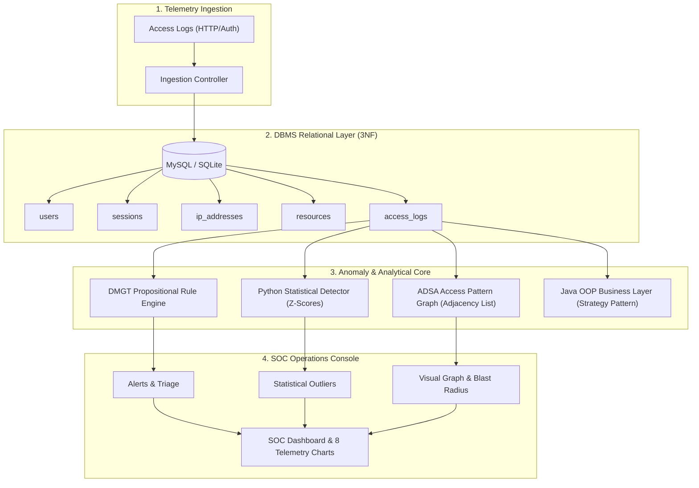
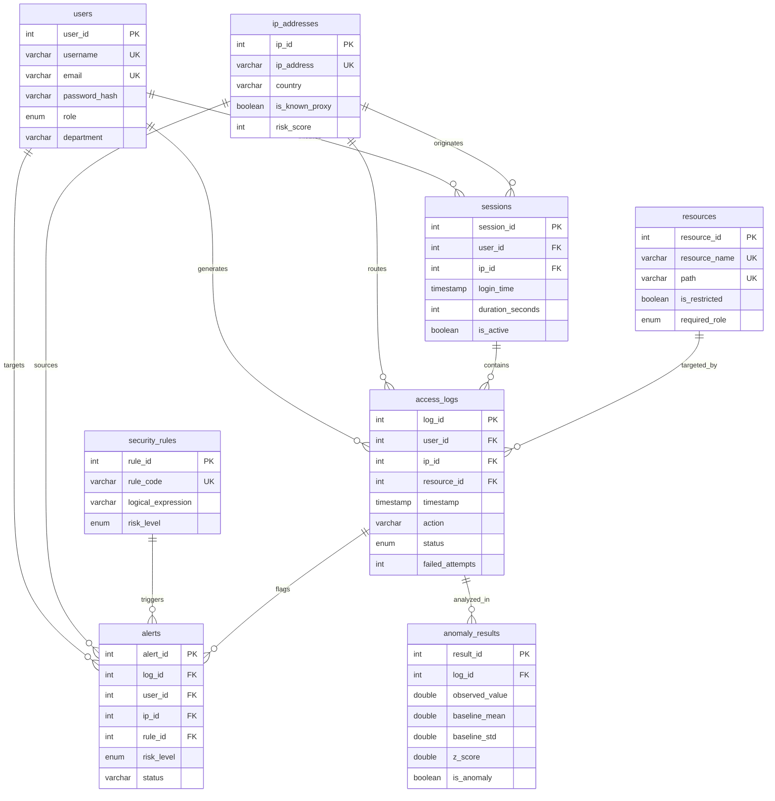
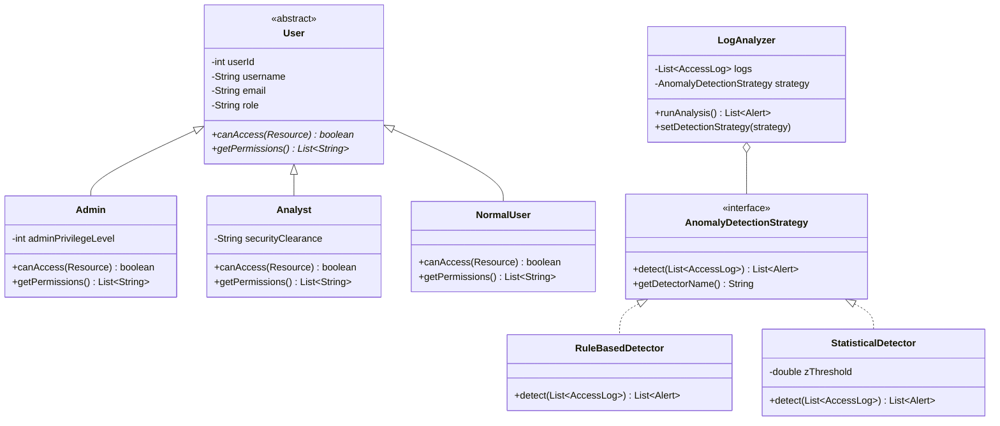
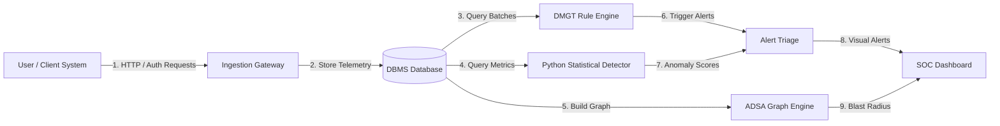

# SENTINEL: Comprehensive Engineering Viva Voce & Technical Documentation Guide

**Project Title:** SENTINEL – Intelligent Access Log Monitoring & Anomaly Detection System  
**Academic Alignment:** 2nd-Year Computer Science & Engineering Curriculum  
**Disciplines Integrated:** DBMS • DMGT • ADSA • OOPJ • Python • Cybersecurity  

---

## 1. Problem Statement
Modern enterprise infrastructures face continuous cyber threats targeting identity and access management (IAM) layers, such as brute-force password guessing, credential stuffing from proxy/Tor networks, insider privilege escalation, and off-hours unauthorized data extraction. Traditional perimeter firewalls cannot easily detect malicious actions that use valid authentication protocols. Furthermore, security operations centers (SOC) are overwhelmed by millions of raw log lines lacking contextual anomaly correlation.

## 2. Existing System vs. Proposed System

| Feature / Dimension | Traditional / Existing College Projects | SENTINEL (Proposed System) |
| :--- | :--- | :--- |
| **System Scope** | Simple CRUD form with static table view | Full-scale SOC Telemetry Monitoring Dashboard |
| **Database Architecture** | Flat unnormalized tables, basic SELECT * queries | Fully normalized **3NF Relational Schema** with 8 tables, foreign keys, indexes, and 10 advanced analytical queries |
| **Detection Logic** | Hardcoded if-else statements | **DMGT Propositional Logic Engine** with formal truth tables and compound rules |
| **Pattern Discovery** | None (manual inspection) | **ADSA Access Pattern Graph** with Adjacency List, BFS, and DFS traversals |
| **Statistical Analysis** | None or fake "AI" claims | Rigorous **Python Statistical Anomaly Engine** calculating Mean, Std Dev, and Z-Scores |
| **Application Layer** | Procedural script | **Enterprise Java OOP Architecture** with inheritance, polymorphism, strategy patterns, and custom exceptions |
| **Investigation** | Static printout | Interactive **Incident Workbench with Blast Radius** and temporal timeline |

## 3. Objectives
1. Ingest, store, and index access log telemetry in a normalized 3NF relational database.
2. Apply formal propositional logic (DMGT) to detect multi-variable security rule violations.
3. Model access relationships as a directed graph ($U \to IP \to S \to R$) to compute blast radius via BFS and attack sequences via DFS.
4. Establish dynamic statistical baselines ($\mu, \sigma$) in Python to flag mathematical outliers ($|z| \ge 2.5$).
5. Demonstrate all fundamental object-oriented principles in Java (Encapsulation, Inheritance, Polymorphism, Abstraction, Interfaces, Exceptions, Collections).
6. Provide an intuitive SOC dashboard with 8 real-time visual telemetry charts.

---

## 4. System Architecture

---

## 5. Modules Breakdown
1. **Module 1 – Login & Role-Based Access Control (RBAC):** Admin, Analyst, and User roles with cryptographic password hashing.
2. **Module 2 – DBMS Relational Engine:** 3NF schema, integrity constraints, and 10 advanced curriculum anomaly queries.
3. **Module 3 – DMGT Anomaly Logic:** Propositional logic rules ($P_1 \dots P_6$) with truth evaluation and compound risk determination.
4. **Module 4 – ADSA Access Graph:** Adjacency List graph representation with BFS (blast radius) and DFS (trajectory exploration).
5. **Module 5 – OOPJ Java Layer:** Clean Java classes demonstrating Encapsulation, Inheritance, Polymorphism, and Strategy design patterns.
6. **Module 6 – Python Statistical Detector:** Mean, Median, Standard Deviation, and Z-score outlier detection.
7. **Module 7 – SOC Telemetry Dashboard:** 6 KPI cards and 8 real-time SVG charts.
8. **Module 8 – Live Access Log Monitor:** Search, multi-field filters, pagination, and anomaly highlights.
9. **Module 9 – Alert Investigation Workbench:** Timeline analysis, DMGT truth table breakdown, and blast radius calculation.
10. **Module 10 – Graph Explorer:** Interactive canvas with node dragging and animated traversal steps.
11. **Module 11 – Incident Reporting:** Executive summary and CSV export.

---

## 6. Entity-Relationship (ER) Diagram

---

## 7. Database Normalization (DBMS Theory)
- **1NF (First Normal Form):** Every attribute contains atomic values (no repeating groups or comma-separated lists in cells).
- **2NF (Second Normal Form):** Satisfies 1NF and all non-key attributes are fully functionally dependent on the entire primary key (elimination of partial key dependencies using synthetic surrogate primary keys like `user_id`, `ip_id`).
- **3NF (Third Normal Form):** Satisfies 2NF and has no transitive dependencies ($X \to Y$ where neither $X$ nor $Y$ is a candidate key). IP geographic reputation and resource metadata are split from `access_logs` into dedicated `ip_addresses` and `resources` tables.

---

## 8. DMGT Propositional Logic Formulation

### Atomic Propositions:
- $P_1$: $\text{failed\_attempts} > 5 \implies \text{True}$
- $P_2$: $\text{request\_velocity} > 100\text{ rpm} \implies \text{True}$
- $P_3$: $\text{hour} \in [23\dots 05] \implies \text{True}$ (Off-hours access)
- $P_4$: $\text{is\_restricted} \wedge (\text{user\_role} \ne \text{ADMIN}) \implies \text{True}$ (Privilege violation)
- $P_5$: $\text{distinct\_users\_on\_ip} \ge 3 \vee \text{is\_proxy} \implies \text{True}$ (Proxy/Credential stuffing)
- $P_6$: $\text{session\_duration} > 28800\text{s} \implies \text{True}$ (Zombie session)

### Compound Formulas & Risk Inference:
$$\text{CRITICAL} \equiv (P_1 \wedge P_4) \vee (P_1 \wedge P_5)$$
$$\text{HIGH} \equiv (P_1 \wedge P_3) \vee P_4 \vee (P_5 \wedge P_2)$$
$$\text{MEDIUM} \equiv P_1 \vee P_2 \vee P_3 \vee P_6$$
$$\text{LOW} \equiv \text{Benign operational activity}$$

---

## 9. ADSA Graph Algorithms & Complexity Analysis

- **Graph Structure:** $G = (V, E)$ where $V = V_{\text{User}} \cup V_{\text{IP}} \cup V_{\text{Session}} \cup V_{\text{Resource}}$.
- **Adjacency List Representation:** Space complexity $O(|V| + |E|)$.
- **Breadth-First Search (BFS):**
  - **Data Structure:** First-In First-Out (FIFO) `Queue` + `Visited Set`.
  - **Time Complexity:** $O(|V| + |E|)$.
  - **Cybersecurity Application:** Computes the shortest connection path and multi-hop **blast radius** around a compromised node.
- **Depth-First Search (DFS):**
  - **Data Structure:** Last-In First-Out (LIFO) `Stack` / Recursion.
  - **Time Complexity:** $O(|V| + |E|)$.
  - **Cybersecurity Application:** Explores deep penetrations and multi-step attack sequences.

---

## 10. OOPJ Class Architecture & Design Principles

### 6 OOP Principles Demonstrated:
1. **Encapsulation:** Private fields with controlled getters/setters in `User`, `Session`, `AccessLog`, `Resource`, `IPAddress`.
2. **Inheritance:** `Admin`, `Analyst`, and `NormalUser` extend abstract `User`.
3. **Polymorphism:** Dynamic method dispatch via `User.canAccess()` and `AnomalyDetectionStrategy.detect()`.
4. **Abstraction:** Abstract class `User` and interface `AnomalyDetectionStrategy`.
5. **Exception Handling:** Checked `SecurityRuleViolationException` and unchecked `InvalidLogFormatException`.
6. **Collections Framework:** `List`, `Map`, `Set`, `Queue` (LinkedList in BFS), `Stack` in DFS.

---

## 11. Python Statistical Anomaly Detection Formulation

1. **Sample Mean ($\mu$):**
   $$\mu = \frac{1}{N} \sum_{i=1}^N x_i$$
2. **Sample Standard Deviation ($\sigma$):**
   $$\sigma = \sqrt{\frac{1}{N-1} \sum_{i=1}^N (x_i - \mu)^2}$$
3. **Z-Score ($z$):**
   $$z = \frac{x - \mu}{\sigma}$$
4. **Decision Boundary:** An observation is flagged as an anomaly if $|z| \ge \text{Threshold}$ (default 2.5). Under the 68–95–99.7 Empirical Rule, $|z| \ge 2.5$ represents less than 1.2% of normal Gaussian distribution probability.

---

## 12. Data Flow Diagram (DFD)

---

## 13. Top 15 Viva Questions & Answers

### Q1: What is the main objective of project SENTINEL?
**Answer:** To monitor user access and authentication logs in real-time, store them in a normalized 3NF database, and identify suspicious security anomalies (brute force, credential stuffing, insider threats) using formal mathematical logic (DMGT), graph algorithms (ADSA), and statistical Z-score models (Python).

### Q2: Why is the database organized in Third Normal Form (3NF)?
**Answer:** To eliminate data redundancy and prevent insertion, update, and deletion anomalies. By separating users, sessions, resources, and IP reputations into independent tables with foreign key constraints, storage is optimized and relational integrity is strictly preserved.

### Q3: How does the DMGT rule engine differ from simple nested if-else checks?
**Answer:** The DMGT engine implements formal propositional logic. Each condition is an atomic proposition ($P_1 \dots P_6$) with a defined truth value. Compound formulas use standard logical connectives (Conjunction $\wedge$, Disjunction $\vee$, Negation $\neg$) to evaluate multi-factor security conditions with an auditable truth trace.

### Q4: What does the ADSA graph represent, and why is it useful?
**Answer:** The graph models the chain of custody: $\text{USER} \to \text{IP} \to \text{SESSION} \to \text{RESOURCE}$. It allows the SOC analyst to find which resources a compromised IP accessed, identify proxy hubs multiplexing accounts, and calculate the blast radius of an incident.

### Q5: What algorithm calculates the blast radius?
**Answer:** Breadth-First Search (BFS) using a FIFO queue. It systematically traverses neighbor nodes level-by-level up to a maximum depth, finding all impacted users, active sessions, and exposed confidential assets in $O(V + E)$ time.

### Q6: What is a Z-score and how is it used in Python?
**Answer:** A Z-score $z = (x - \mu)/\sigma$ standardizes an observation by measuring how many standard deviations it lies away from the baseline mean. If $|z| \ge 2.5$, the event is mathematically atypical and flagged as an anomaly.

### Q7: Why do you call this "statistical anomaly detection" instead of "AI"?
**Answer:** Because it computes rigorous statistical measures (mean, standard deviation, Z-scores, normal distributions) rather than using black-box neural networks. This makes it mathematically explainable and reliable for 2nd-year engineering defense.

### Q8: What OOP design pattern is used in the Java layer?
**Answer:** The **Strategy Design Pattern** via the `AnomalyDetectionStrategy` interface. It allows the `LogAnalyzer` class to switch between `RuleBasedDetector` and `StatisticalDetector` dynamically at runtime without altering client code (adhering to the Open/Closed Principle).

### Q9: How is Polymorphism demonstrated in Java?
**Answer:** Through the `User` class hierarchy. When iterating through a `List<User>`, invoking `user.canAccess(resource)` executes the overridden subclass implementation (`Admin.canAccess` returns true, while `NormalUser.canAccess` denies restricted assets).

### Q10: What custom exception is implemented in Java?
**Answer:** `SecurityRuleViolationException`, a checked exception extending `java.lang.Exception`, thrown when an unauthorized user attempts to access confidential resources or violates hard security propositions.

### Q11: How does the system detect Credential Stuffing?
**Answer:** By combining DBMS aggregate query #5 (`COUNT(DISTINCT user_id) > 2 GROUP BY ip_id`) and DMGT compound rule #7 ($P_1 \wedge P_5$), flagging single proxy IPs targeting multiple usernames with failed logins.

### Q12: How does the system detect Off-Hours Insider Probing?
**Answer:** By evaluating timestamp hour ($23 \le \text{hour} \le 5$) combined with access to restricted resources ($P_3 \wedge P_4$), triggering a CRITICAL severity alert.

### Q13: What are the primary tables in the DBMS schema?
**Answer:** `users`, `ip_addresses`, `resources`, `sessions`, `security_rules`, `access_logs`, `alerts`, and `anomaly_results`.

### Q14: How does the SOC dashboard update in real-time?
**Answer:** The frontend polls the `/api/stats` and `/api/logs` REST endpoints every 5 seconds. The user can also inject live simulated attack bursts using the "Simulate Attack Burst" button.

### Q15: What is the time complexity of the SQL queries?
**Answer:** With B-Tree indexes on `timestamp`, `user_id`, `ip_id`, and `resource_id`, single-row lookups and indexed joins run in $O(\log N)$, while grouping queries run in $O(N \log N)$ where $N$ is the number of access logs.

---

## 14. Test Cases & Verification Matrix

| Test ID | Test Scenario | Input Data | Expected Output | Status |
| :--- | :--- | :--- | :--- | :--- |
| **TC-01** | Database Schema Creation | Run `sentinel_schema.sql` | 8 normalized tables created with constraints & indexes | PASS |
| **TC-02** | Seed Realistic Data | Run `db_init.py` | 550+ records populated across users, IPs, sessions, and logs | PASS |
| **TC-03** | DMGT Proposition Evaluation | Event with `failed_attempts = 7` | Triggers $P_1$, assigns HIGH risk, audit trail generated | PASS |
| **TC-04** | Compound Rule Trigger | `failed_attempts = 8` AND `proxy = True` | Triggers $P_1 \wedge P_5$ (Credential Stuffing), CRITICAL risk | PASS |
| **TC-05** | ADSA Graph Construction | Build graph from 300 logs | 60+ nodes and 200+ edges created in adjacency list | PASS |
| **TC-06** | BFS Blast Radius | Start from `USER:11` | Discovers 16 reachable downstream nodes | PASS |
| **TC-07** | DFS Attack Path | Start from `IP:8` (Tor Exit) | Discovers deep access trajectory across endpoints | PASS |
| **TC-08** | Python Z-Score Calculation | Session duration of 38,400s (10.7h) | Computes $z = +4.65 \ge 2.5$, flags `SESSION_DURATION_OUTLIER` | PASS |
| **TC-09** | OOPJ Strategy Dispatch | Run `Main.java` | Demonstrates dynamic strategy swap between Rule and Stat | PASS |
| **TC-10** | REST API Health Check | Query `/api/stats` | Returns JSON with 6 KPIs and 8 chart datasets | PASS |

---

## 15. Limitations & Future Scope
- **Current Limitations:** Runs with simulated enterprise access logs; uses local SQLite/MySQL engine without distributed cluster partitioning.
- **Future Enhancements:**
  1. Integration with real-world Apache / Nginx web server access log pipelines via Apache Kafka.
  2. Multi-factor authentication (MFA) step-up challenge triggers when Z-score exceeds 3.0.
  3. Distributed graph database backend (Neo4j / Amazon Neptune) for billion-node graph analytics.
  4. Machine Learning ensemble (Isolation Forests & One-Class SVM) alongside statistical baselines.

---

## 16. Conclusion
SENTINEL successfully demonstrates how five fundamental computer science subjects (DBMS, DMGT, ADSA, OOPJ, Python) directly converge to build an industry-grade Cybersecurity Security Operations Center monitoring system. Rather than being a basic CRUD form, SENTINEL provides a complete and defensible story: **Collect → Store → Analyze → Detect → Connect → Alert → Investigate → Report**.
